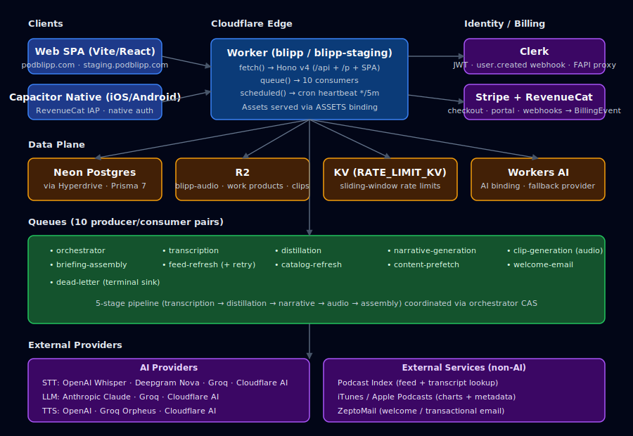
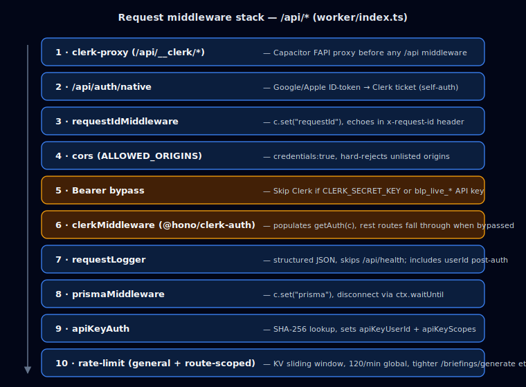
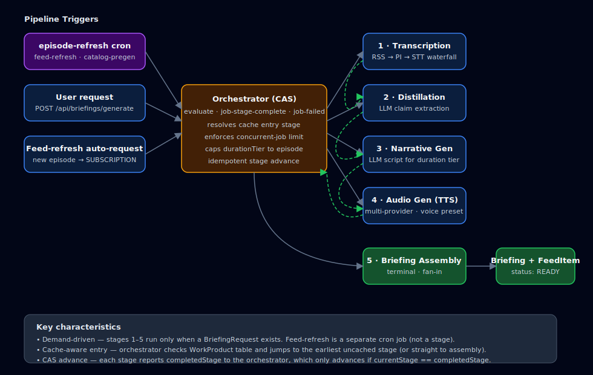
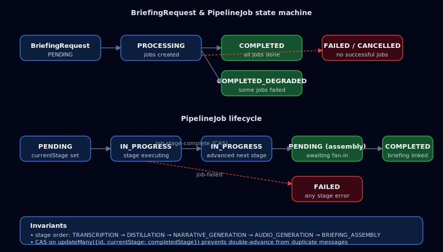
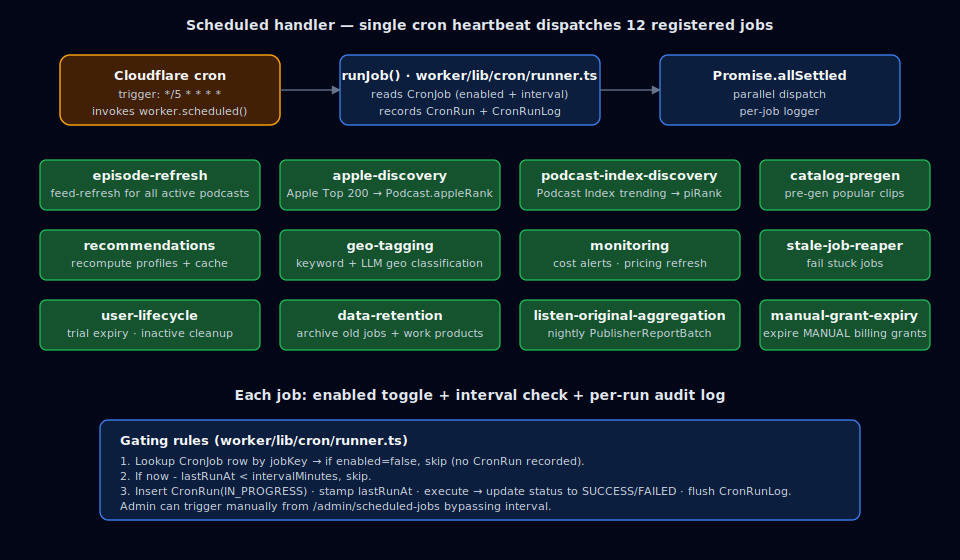

# Blipp Architecture

Blipp turns podcasts into short, personalized audio briefings ("blipps"). Users subscribe to shows, an orchestrated pipeline pulls transcripts, distills them into claims, writes narrative scripts, and renders them as multi-provider TTS audio. The entire product runs as a single Cloudflare Worker at `podblipp.com` (production) and `staging.podblipp.com` (staging).

> Companion docs: [pipeline.md](./pipeline.md) · [data-model.md](./data-model.md) · [api-reference.md](./api-reference.md) · [admin-platform.md](./admin-platform.md) · [guides/development.md](./guides/development.md) · [guides/production-deployment.md](./guides/production-deployment.md).

## System Overview



A single Cloudflare Worker (`blipp` / `blipp-staging`) serves three Cloudflare handlers from one codebase:

| Handler | Source | Purpose |
|---------|--------|---------|
| `fetch` | `worker/index.ts` | Hono v4 HTTP server — `/api/*`, `/p/*` SEO pages, static SPA via `ASSETS` |
| `queue` | `worker/queues/index.ts` (`handleQueue`) | Dispatcher for 10 Cloudflare Queues (pipeline + system) |
| `scheduled` | `worker/queues/index.ts` (`scheduled`) | Cron heartbeat every 5 minutes; dispatches 12 cron jobs |

`shimQueuesForLocalDev()` overlays an in-process queue shim when `ENVIRONMENT=development` so pipeline stages work under `wrangler dev` without Cloudflare Queues provisioning.

## Tech Stack

| Layer | Technology |
|-------|-----------|
| Runtime | Cloudflare Workers (fetch + queue + scheduled) |
| HTTP framework | Hono v4 |
| Database | PostgreSQL on Neon |
| ORM | Prisma 7 with `prisma-client` output + Cloudflare Hyperdrive |
| Auth | Clerk (`@hono/clerk-auth` middleware, FAPI proxy for native apps) |
| Web payments | Stripe (Checkout + Customer Portal + webhooks) |
| Mobile IAP | Apple StoreKit via RevenueCat (webhook + REST v2 API) |
| Transactional email | ZeptoMail (template API, welcome emails) |
| Object storage | Cloudflare R2 (work products, audio clips, benchmark artifacts) |
| Rate-limit storage | Cloudflare KV (`RATE_LIMIT_KV`) |
| Task queues | 10 Cloudflare Queues + a dead-letter queue |
| AI — LLM | Anthropic Claude, Groq, Cloudflare Workers AI |
| AI — STT | OpenAI Whisper, Deepgram Nova, Groq, Cloudflare Workers AI |
| AI — TTS | OpenAI, Groq (Orpheus), Cloudflare Workers AI |
| Podcast discovery | Podcast Index (trending, transcript lookup) + Apple Podcasts (top-200 charts) |
| Frontend | React 19 + Vite 7 + Tailwind v4 + shadcn/ui + vite-plugin-pwa |
| Native shell | Capacitor (iOS + Android), `@capgo/capacitor-social-login`, RevenueCat SDK |

## Middleware Stack

Global middleware is wired in `worker/index.ts`. Order matters.



| # | Middleware | File | Scope | Notes |
|---|-----------|------|-------|-------|
| pre | Clerk FAPI proxy | `worker/routes/clerk-proxy.ts` | `/api/__clerk/*` | Capacitor-safe proxy for Clerk's FAPI; must run before any `/api` middleware. |
| pre | Native auth | `worker/routes/native-auth.ts` | `/api/auth/*` | Exchanges Google/Apple ID tokens for Clerk sign-in tickets; handles its own verification. |
| 1 | Request ID | `middleware/request-id.ts` | `/api/*` | Generates or reuses `x-request-id`; echoed on every response. |
| 2 | CORS | `hono/cors` | `/api/*` | Origins from `ALLOWED_ORIGINS` env — hard rejects unlisted origins. |
| 3 | Clerk bypass + auth | inline + `middleware/auth.ts` | `/api/*` | Short-circuits Clerk when the `Authorization` Bearer token matches `CLERK_SECRET_KEY` or a `blp_live_*` API key; otherwise applies `clerkMiddleware()`. |
| 4 | Request logger | `middleware/request-logger.ts` | `/api/*` | Structured JSON (userId, status, duration). Skips `/api/health`. |
| 5 | Prisma | `middleware/prisma.ts` | `/api/*` | Creates a per-request `PrismaClient`; `c.get("prisma")`; auto-`$disconnect` via `ctx.waitUntil`. |
| 6 | API key auth | `middleware/api-key.ts` | `/api/*` | SHA-256 lookup on `ApiKey`; sets `apiKeyUserId`/`apiKeyScopes`. Falls through to Clerk if absent. |
| 7 | Rate limits | `middleware/rate-limit.ts` | `/api/*` (+ tighter on specific routes) | KV sliding window. Defaults: 120/min general, 10/hour `/briefings/generate`, 5/min `/podcasts/subscribe`, 20/min `/voice-presets/:id/preview`. Config-overridable (`rateLimit.*`). Webhooks + health are exempt. |
| 8 | Response cache | `middleware/cache.ts` | `/api/podcasts/catalog`, `/api/health/deep` | `max-age` + `stale-while-revalidate`. |
| 9 | Security headers | `middleware/security-headers.ts` | `/*` | CSP, HSTS, X-Frame-Options — applied to SPA too. |

Route handlers always read the DB through `c.get("prisma") as PrismaClient`.

## Environment Bindings

Declared in `wrangler.jsonc` (staging) and `env.production` (production). Staging and production use identical binding *names* mapped to different resource IDs.

### Secrets & variables

| Binding | Type | Purpose |
|---------|------|---------|
| `CLERK_SECRET_KEY` / `CLERK_PUBLISHABLE_KEY` / `CLERK_WEBHOOK_SECRET` / `CLERK_FAPI_URL` | string | Clerk auth and webhook verification; FAPI proxy origin |
| `STRIPE_SECRET_KEY` / `STRIPE_WEBHOOK_SECRET` | string | Stripe billing + webhook verification |
| `REVENUECAT_WEBHOOK_SECRET` / `REVENUECAT_REST_API_KEY` / `REVENUECAT_PROJECT_ID` | string? | Apple IAP entitlement sync |
| `ANTHROPIC_API_KEY` / `OPENAI_API_KEY` / `GROQ_API_KEY` / `DEEPGRAM_API_KEY` | string | AI providers (distillation, narrative, TTS, STT) |
| `PODCAST_INDEX_KEY` / `PODCAST_INDEX_SECRET` | string | Podcast Index API (HMAC-SHA1 auth) |
| `ZEPTOMAIL_TOKEN` / `ZEPTOMAIL_FROM_*` / `ZEPTOMAIL_WELCOME_TEMPLATE_KEY` | string? | Transactional email |
| `VAPID_PUBLIC_KEY` / `VAPID_PRIVATE_KEY` / `VAPID_SUBJECT` | string? | Web Push (optional) |
| `NEON_API_KEY` / `NEON_PROJECT_ID` | string? | Backup verification (optional) |
| `CF_API_TOKEN` / `CF_ACCOUNT_ID` / `WORKER_SCRIPT_NAME` | string? | Observability queries + admin worker-logs page |
| `GITHUB_TOKEN` | string? | Trigger GitHub Actions (e.g. Apple catalog refresh) |
| `SERVICE_KEY_ENCRYPTION_KEY` | string? | 64-hex AES-256 master key for encrypted `ServiceKey` rows |
| `ALLOWED_ORIGINS` / `APP_ORIGIN` / `ENVIRONMENT` | string | CORS allowlist, absolute base URL (Stripe redirects), dev/staging/prod flag |

### Bindings (resources)

| Binding | Resource | Notes |
|---------|----------|-------|
| `ASSETS` | Vite-built SPA | `not_found_handling: single-page-application`; `run_worker_first` for `/api/*`, `/p/*`, `/sitemap.xml`, `/robots.txt` |
| `HYPERDRIVE` | Cloudflare Hyperdrive → Neon pooled | Single shared binding; production and staging target separate Hyperdrive configs |
| `R2` | Cloudflare R2 | `blipp-audio` (prod) / `blipp-audio-staging` (staging) |
| `RATE_LIMIT_KV` | Cloudflare KV | Sliding-window buckets |
| `AI` | Workers AI | Fallback STT/LLM/TTS provider |
| `FEED_REFRESH_QUEUE` | Queue | RSS polling (producer + consumer) |
| `TRANSCRIPTION_QUEUE` | Queue | Stage 1 |
| `DISTILLATION_QUEUE` | Queue | Stage 2 |
| `NARRATIVE_GENERATION_QUEUE` | Queue | Stage 3 |
| `AUDIO_GENERATION_QUEUE` | Queue | Stage 4 (consumer queue named `clip-generation` — legacy) |
| `BRIEFING_ASSEMBLY_QUEUE` | Queue | Stage 5 |
| `ORCHESTRATOR_QUEUE` | Queue | Pipeline coordination |
| `CATALOG_REFRESH_QUEUE` | Queue | Apple / Podcast Index discovery |
| `CONTENT_PREFETCH_QUEUE` | Queue | Audio + transcript availability probe |
| `WELCOME_EMAIL_QUEUE` | Queue | One-shot welcome email on `user.created` |

Cron trigger: `*/5 * * * *` (identical in staging and production). All scheduled jobs run inside `scheduled()` and are gated individually by `CronJob.enabled` + `intervalMinutes`.

## Queue System

| Binding | Queue name (prod / staging) | Batch | Concurrency | Retries | DLQ |
|---------|-----------------------------|------:|-----------:|--------:|-----|
| `FEED_REFRESH_QUEUE` | `feed-refresh` | 1 | 10 | 3 | `feed-refresh-retry` |
| `feed-refresh-retry` | `feed-refresh-retry` | 1 | 1 | 2 | — |
| `TRANSCRIPTION_QUEUE` | `transcription` | 1 | 5 | 3 | `dead-letter` |
| `DISTILLATION_QUEUE` | `distillation` | 5 | auto | 3 | `dead-letter` |
| `NARRATIVE_GENERATION_QUEUE` | `narrative-generation` | 5 | auto | 3 | `dead-letter` |
| `AUDIO_GENERATION_QUEUE` | `clip-generation` | 3 | auto | 3 | `dead-letter` |
| `BRIEFING_ASSEMBLY_QUEUE` | `briefing-assembly` | 5 | auto | 3 | `dead-letter` |
| `ORCHESTRATOR_QUEUE` | `orchestrator` | 10 | auto | 3 | `dead-letter` |
| `CATALOG_REFRESH_QUEUE` | `catalog-refresh` | 1 | auto | 3 | `dead-letter` |
| `CONTENT_PREFETCH_QUEUE` | `content-prefetch` | 10 | 20 | 2 | `dead-letter` |
| `WELCOME_EMAIL_QUEUE` | `welcome-email` | 5 | auto | 3 | `dead-letter` |
| DLQ | `dead-letter` | 25 | auto | 0 | — (logs + drops) |

*"auto" = `max_concurrency` is omitted from the consumer config in `wrangler.jsonc` and Cloudflare auto-scales concurrency up to platform limits. Explicit numbers are caps.*

`handleQueue()` in `worker/queues/index.ts` strips the environment suffix (`-staging`/`-production`) before routing by normalized queue name. The `AUDIO_GENERATION_QUEUE` binding deliberately maps to the `clip-generation` queue name for historical reasons — the dispatcher routes `clip-generation` → `handleAudioGeneration`.

## Pipeline Architecture

The pipeline is **demand-driven**. Only `episode-refresh` (feed refresh) runs on cron; the other stages execute only when a `BriefingRequest` exists.



| # | Stage | Queue | Handler | Output |
|---|-------|-------|---------|--------|
| 1 | Transcription | `transcription` | `worker/queues/transcription.ts` | `WorkProduct(TRANSCRIPT)`, `Distillation.transcript` |
| 2 | Distillation | `distillation` | `worker/queues/distillation.ts` | `WorkProduct(CLAIMS)`, `Distillation.claimsJson` |
| 3 | Narrative generation | `narrative-generation` | `worker/queues/narrative-generation.ts` | `WorkProduct(NARRATIVE)`, `Clip.narrativeText` |
| 4 | Audio generation (TTS) | `clip-generation` | `worker/queues/audio-generation.ts` | `WorkProduct(AUDIO_CLIP)`, `Clip.audioKey`, `Clip.status=COMPLETED` |
| 5 | Briefing assembly | `briefing-assembly` | `worker/queues/briefing-assembly.ts` | `Briefing`, `FeedItem.briefingId`, `FeedItem.status=READY` |

See [pipeline.md](./pipeline.md) for the full stage-by-stage spec, including the three-tier transcript waterfall, multi-provider fallback chains, circuit breaker, and partial-completion (`COMPLETED_DEGRADED`) semantics.

### Orchestrator



`worker/queues/orchestrator.ts` receives messages on `ORCHESTRATOR_QUEUE` with three action types:

- `evaluate` — new `BriefingRequest`; resolves `useLatest` items, caps `durationTier` against episode length, enforces `Plan.concurrentPipelineJobs`, creates `PipelineJob` rows, and dispatches each to the earliest *uncached* stage (or straight to `BRIEFING_ASSEMBLY` if fully cached).
- `job-stage-complete` — a stage finished; uses `completedStage` from the message (not the potentially stale `PipelineJob.currentStage`) as the CAS condition for `updateMany`, advances the job to the next stage, and fires off the next queue message. When every job in the request is at `BRIEFING_ASSEMBLY` PENDING or terminal, it dispatches assembly.
- `job-failed` — marks the job FAILED and still dispatches assembly when all other jobs are terminal so surviving jobs can be assembled (`COMPLETED_DEGRADED`).

SEO-backfill mode (`BriefingRequestMode.SEO_BACKFILL`) stops after DISTILLATION and never emits narrative/audio/assembly messages.

### WorkProduct R2 keying

Pipeline outputs live in R2 under deterministic keys indexed by `WorkProduct`:

| Type | R2 key | Written by |
|------|--------|-----------|
| `TRANSCRIPT` | `wp/transcript/{episodeId}.txt` | Transcription |
| `CLAIMS` | `wp/claims/{episodeId}.json` | Distillation |
| `NARRATIVE` | `wp/narrative/{episodeId}/{durationTier}.txt` | Narrative Gen |
| `AUDIO_CLIP` | `wp/clip/{episodeId}/{durationTier}/{voice}.mp3` | Audio Gen |
| `SOURCE_AUDIO` | `wp/source-audio/{episodeId}.bin` | Transcription (debug) |
| `BRIEFING_AUDIO` | reserved (no builder) | — |
| `DIGEST_NARRATIVE`/`DIGEST_CLIP`/`DIGEST_AUDIO` | digest-specific keys | Digest pipeline |

`wpKey()` in `worker/lib/work-products.ts` is the canonical key builder.

## Scheduled Jobs



The Worker cron fires every 5 minutes; `scheduled()` dispatches all registered jobs in parallel via `Promise.allSettled`. Each job checks its `CronJob` row (`enabled`, `intervalMinutes`, `runAtHour`) before running and records a `CronRun` row with `CronRunLog` entries.

| Job key | Source | Purpose |
|---------|--------|---------|
| `episode-refresh` | `worker/lib/cron/episode-refresh.ts` | Enqueue feed-refresh for every non-archived podcast; gates via `pipeline.enabled` |
| `apple-discovery` | `worker/lib/cron/podcast-discovery.ts` | Fetch Apple top-200 charts → update `Podcast.appleRank` |
| `podcast-index-discovery` | `worker/lib/cron/podcast-discovery.ts` | Fetch Podcast Index trending → update `Podcast.piRank` |
| `catalog-pregen` | `worker/lib/cron/catalog-pregen.ts` | Pre-generate popular clips (SEO backfill + warm cache) |
| `monitoring` | `worker/lib/cron/monitoring.ts` | Cost alerts, pricing refresh, health checks |
| `user-lifecycle` | `worker/lib/cron/user-lifecycle.ts` | Logs users whose free trial has expired (no enforcement yet — reminder emails/feature restrictions are planned) |
| `data-retention` | `worker/lib/cron/data-retention.ts` | Archive old `BriefingRequest`/`PipelineJob`/WorkProducts |
| `recommendations` | `worker/lib/cron/recommendations.ts` | Recompute `UserRecommendationProfile` + `RecommendationCache` |
| `listen-original-aggregation` | `worker/lib/cron/listen-original-aggregation.ts` | Roll `ListenOriginalEvent` into `PublisherReportBatch` |
| `stale-job-reaper` | `worker/lib/cron/stale-job-reaper.ts` | Fail jobs stuck in PENDING past timeout |
| `geo-tagging` | `worker/lib/cron/geo-tagging.ts` | Keyword + LLM geo classification for podcasts |
| `manual-grant-expiry` | `worker/lib/cron/manual-grant-expiry.ts` | Expire MANUAL billing grants at `currentPeriodEnd` |

## Runtime Configuration

Pipeline and product behaviour is driven from the `PlatformConfig` table with a 60-second TTL in-memory cache. Config keys are either **static** (validated via `CONFIG_REGISTRY` in `worker/lib/config-registry.ts`) or **dynamic pattern-based** (cron toggles, stage model overrides, feature flags, service-key assignments).

Representative static keys:

| Key | Default | Purpose |
|-----|---------|---------|
| `pipeline.enabled` | `true` | Master kill switch |
| `pipeline.logLevel` | `"info"` | Structured log verbosity |
| `pipeline.feedRefresh.maxEpisodesPerPodcast` | `5` | Ingest cap per poll |
| `pipeline.feedRefresh.batchConcurrency` | `10` | Podcasts processed per feed-refresh message |
| `pipeline.distillation.rateLimitRetries` | `3` | Retries on 429s from LLM provider |
| `pipeline.contentPrefetch.fetchTimeoutMs` | `15000` | Transcript/audio probe timeout |
| `catalog.source` | `"podcast-index"` | Default discovery source |
| `catalog.maxSize` | `10000` | Hard cap on active catalog |
| `transcript.sources` | `["rss-feed", "podcast-index"]` | Transcript source priority before STT fallback |
| `audio.defaultVoice` | `"coral"` | Default TTS voice when user has no preset |
| `audio.wordsPerMinute` | `150` | Assumed speaking rate for duration estimation |
| `circuitBreaker.failureThreshold` | `5` | Consecutive failures before opening |
| `circuitBreaker.cooldownMs` | `30000` | Half-open test delay |
| `rateLimit.*.windowMs` / `.maxRequests` | various | Per-route rate limits |
| `welcomeEmail.enabled` | `true` | ZeptoMail welcome emails |
| `user.trialDays` | `14` | Trial duration |
| `recommendations.*` | various | Scoring weights, cold-start gates, diversification |
| `cost.alert.{daily,weekly}Threshold` | `5.0` / `25.0` | Monitoring thresholds |

Dynamic key patterns:

| Pattern | Purpose |
|---------|---------|
| `cron.{jobKey}.{enabled,intervalMinutes,lastRunAt}` | Per-job schedule controls |
| `pipeline.stage.{STAGE}.enabled` | Per-stage kill switch; manual messages (`type:"manual"`) bypass. |
| `ai.{stage}.model`, `ai.{stage}.model.secondary`, `ai.{stage}.model.tertiary` | Primary/secondary/tertiary model+provider per stage. |
| `prompt.*` | Prompt-template overrides (distillation, narrative). |
| `feature.*` | Feature flags (see below). |
| `serviceKey.assignment.{context}[.provider]` | Pin a usage context to a specific `ServiceKey` row. |

## Multi-Provider AI Architecture

Every AI call goes through a provider-scoped registry:

| Registry | Source | Providers |
|----------|--------|-----------|
| STT | `worker/lib/stt/providers.ts` | OpenAI (`whisper-1`), Deepgram (`nova-2`, `nova-3`), Groq (openai-compatible), Cloudflare (`@cf/openai/whisper`, `@cf/deepgram/speech-recognition`) |
| LLM | `worker/lib/llm-providers.ts` | Anthropic (prompt caching supported), Groq, Cloudflare AI |
| TTS | `worker/lib/tts/providers.ts` | OpenAI, Groq (Orpheus), Cloudflare AI |

`resolveStageModel()` (`worker/lib/model-resolution.ts`) looks up `ai.{stage}.model`, joins against `AiModelProvider` for pricing + limits, and consults the per-provider circuit breaker (`worker/lib/circuit-breaker.ts`). `resolveModelChain()` returns the primary/secondary/tertiary fallback list; circuit-broken providers are filtered out and logged as `provider_failover`.

Cost accounting happens in `worker/lib/ai-usage.ts`:

- Token cost = input + output, with Anthropic cache-write pricing at 1.25× input and cache-read pricing at 0.1× input.
- Audio cost = `durationSeconds / 60 * pricePerMinute`.
- Char-based TTS cost = `charCount / 1000 * pricePerKChars`.

Errors raised by providers flow through `classifyAiError()` + `writeAiError()` → `AiServiceError` rows with category (`rate_limit`, `timeout`, `auth`, `model_not_found`, `content_filter`, `invalid_request`, `server_error`, `network`, `quota_exceeded`, `unknown`), severity, and sanitized raw response (≤2KB).

## Service Keys

`worker/lib/service-key-registry.ts` defines 20 named `ServiceKeyContext`s (auth, billing, pipeline, catalog, infra, push). `ServiceKey` rows store encrypted values (AES-256-GCM, `SERVICE_KEY_ENCRYPTION_KEY` master key, per-row IV). Resolution order in `resolveApiKey()`:

1. **Context assignment** — `serviceKey.assignment.{context}[.{provider}]` in `PlatformConfig` → decrypt the referenced `ServiceKey`.
2. **Primary DB key** — `ServiceKey.envKey == target AND isPrimary == true` → decrypt.
3. **Env var fallback** — `env[envKey]` (logs a warning in the DB-preferred path).

`worker/lib/service-key-health.ts` exposes per-provider health probes (Anthropic, OpenAI, Groq, Deepgram, Stripe, Clerk, Podcast Index, Cloudflare, Neon) used by `/api/admin/service-keys/*` and the admin Service Keys page.

## Authentication & Authorization

### Browser sessions

Clerk is the identity provider. `clerkMiddleware()` populates `getAuth(c)` for all `/api/*` routes. Native apps (Capacitor) use:

- `/__clerk/*` — web FAPI proxy (same-origin cookies).
- `/api/__clerk/*` — Capacitor FAPI proxy (rewrites Set-Cookie for `capacitor://` origins).
- `/api/auth/native` — exchanges Google/Apple ID tokens for Clerk sign-in tickets (server-side verification).

### Server-to-server

Two bypass paths run *before* Clerk middleware:

- `Authorization: Bearer ${CLERK_SECRET_KEY}` — treats the caller as authenticated without a session (used by trusted back-office scripts).
- `Authorization: Bearer blp_live_*` — resolved downstream by `apiKeyAuth` (SHA-256 hash lookup on `ApiKey`). Populates `apiKeyUserId` + `apiKeyScopes`.

### Admin

`requireAdmin` (`worker/middleware/admin.ts`) upgrades `requireAuth` with a `User.isAdmin` check (403 if absent). Applied globally to `/api/admin/*` via `adminRoutes.use("*", requireAdmin)`. Every non-GET admin mutation is automatically recorded to `AuditLog` by middleware in `worker/routes/admin/index.ts`.

### Plan limits

Enforced in route handlers via `worker/lib/plan-limits.ts`:

- `checkDurationLimit` — caps `durationTier` by `Plan.maxDurationMinutes`.
- `checkSubscriptionLimit` — caps active `Subscription` rows by `Plan.maxPodcastSubscriptions`.
- `checkWeeklyBriefingLimit` — caps FeedItem creation per 7-day rolling window by `Plan.briefingsPerWeek`.
- `checkConcurrentJobLimit` — caps IN_PROGRESS `PipelineJob`s per user by `Plan.concurrentPipelineJobs`.
- `checkPastEpisodesLimit` — caps how far back a user may request briefings (`Plan.pastEpisodesLimit`).

`checkConcurrentJobLimit` also runs inside the orchestrator on `evaluate` — if the limit is hit, the request is re-queued rather than failing.

## Billing & Entitlement

Web subscriptions originate from Stripe (Checkout → `customer.subscription.*` webhooks). Mobile subscriptions originate from Apple StoreKit via RevenueCat (webhook + `/v2` REST confirmations). Manual admin grants are a third source. All three land in the unified `BillingSubscription` table keyed by `(source, externalId)`.

`recomputeEntitlement(prisma, userId)` (`worker/lib/entitlement.ts`):

- Finds rows with status ∈ `{ACTIVE, CANCELLED_PENDING_EXPIRY, GRACE_PERIOD}`.
- Picks the highest `Plan.sortOrder` winner and sets `User.planId`.
- Sets `User.subscriptionEndsAt` when the winner is `CANCELLED_PENDING_EXPIRY`, otherwise clears it.
- Falls back to the plan with `isDefault = true` if no entitling rows remain.

Every webhook / REST / admin change logs a `BillingEvent` (APPLIED/SKIPPED/FAILED) with the raw payload; `BillingEvent.userId` is nullable to preserve webhook attempts that pre-date the user record.

## Feature Flags

Stored as `PlatformConfig.feature.*`. `worker/lib/feature-flags.ts` evaluates:

1. Denylist → `false`
2. Allowlist → `true`
3. Date window (`startDate` / `endDate`)
4. `planAvailability[]` containment
5. `rolloutPercentage` via `SHA-256(userId + ":" + flag) % 100`

`isFeatureEnabled(prisma, name, { userId, planSlug })` returns a deterministic boolean; `getActiveFlags(prisma, ctx)` returns a `Record<string, boolean>` snapshot for admin views.

## Frontend Architecture

### Build & serving

Vite 7 + `@cloudflare/vite-plugin` in SPA mode. `vite-plugin-pwa` injects a service worker built from `src/sw.ts` for web clients; Capacitor native builds detect `Capacitor.isNativePlatform()` and unregister the SW to avoid WKWebView cache conflicts. The Worker serves built assets via the `ASSETS` binding. `wrangler.jsonc` `run_worker_first` reserves `/api/*`, `/p/*`, `/sitemap.xml`, and `/robots.txt` for the Worker, and everything else falls through to SPA `index.html`.

### Public + user routes

| Section | Route | Page file | Notes |
|---------|-------|-----------|-------|
| Public | `/` | `pages/landing.tsx` | Signed-in users redirect to `/home` |
| Public | `/pricing`, `/about`, `/how-it-works`, `/contact`, `/support`, `/tos`, `/privacy` | `pages/*.tsx` | Marketing + legal |
| Public | `/pulse`, `/pulse/:slug`, `/pulse/by/:editor`, `/pulse/topic/:slug` | `worker/routes/pulse.ts` | Editorial blog (SSR, DB-backed). `/blog/*` legacy paths 301 here. |
| User | `/home` | `pages/Home.tsx` | Feed view |
| User | `/discover` · `/discover/:podcastId` | `pages/discover.tsx`, `pages/podcast-detail.tsx` | Browse + detail |
| User | `/library` | `pages/library.tsx` | Subscriptions + listening history |
| User | `/history` | `pages/history.tsx` (lazy) | Full listening history |
| User | `/play/:id` | `pages/briefing-player.tsx` | Full-screen audio player |
| User | `/settings` | `pages/Settings.tsx` | Account, plan, voice, preferences |
| User | `/onboarding` | `pages/onboarding.tsx` (lazy) | Inline onboarding flow |
| Compat | `/dashboard` → `/home`, `/billing` → `/settings`, `/briefing/*` → `/home` | redirects | Historical URLs |

User routes are wrapped in `MobileLayout` (header, bottom nav, mini-player, podcast-detail sheet, feedback dialog). The four core tabs are **Home**, **Discover**, **Library**, **Settings**.

### Native app

- Capacitor shell (iOS + Android) with `@capgo/capacitor-social-login`.
- Entry point detects `Capacitor.isNativePlatform()` and switches auth to `NativeSignIn` (Google/Apple + email/password fallback).
- `src/lib/iap.ts` wraps RevenueCat (configured with the Apple API key returned from `/api/iap/config`).
- All API calls go through `src/lib/api-client.ts`, which injects `X-Client-Platform` and resolves a native `VITE_API_BASE_URL` when running inside Capacitor.

### Admin pages

32 lazy-loaded pages under `/admin/*` render the Moonchild dark-navy theme via `AdminLayout`. See [admin-platform.md](./admin-platform.md) for the full inventory and purpose of each page. An `AdminGuard` component calls `/api/admin/dashboard/health` to confirm `User.isAdmin` before rendering. Routes redirect legacy paths: `/admin/catalog-seed` → `/admin/catalog-discovery`, `/admin/stage-models` → `/admin/stage-configuration`, `/admin/prompt-management` → `/admin/stage-configuration`.

### Key frontend modules

| File | Purpose |
|------|---------|
| `src/App.tsx` | Route tree + layouts + lazy loading |
| `src/lib/api-client.ts` | `useApiFetch()` / `useAdminFetch()` hooks with Clerk token + platform header + retry-on-auth-expiry |
| `src/lib/api-base.ts` | Web vs. native base URL resolution |
| `src/lib/use-fetch.ts` | Generic `useFetch<T>()` data-fetching hook |
| `src/lib/iap.ts` | RevenueCat init / offerings / purchase / restore |
| `src/lib/ai-models.ts` | Frontend stage label table (no server imports) |
| `src/contexts/audio-context.tsx` | Global audio playback + queue |
| `src/contexts/plan-context.tsx` | Cached plan + entitlement snapshot |
| `src/contexts/onboarding-context.tsx` | Onboarding + isAdmin flag |
| `src/providers/clerk-provider.tsx` | ClerkProvider with native-aware config (FAPI proxy + capacitor:// normalisation) |

## File Structure

```
blipp/
  worker/
    index.ts                     # Entry: fetch/queue/scheduled
    types.ts                     # Env type
    middleware/                  # Request-ID, auth, API key, admin, prisma, rate-limit, cache, security-headers, request-logger
    routes/
      index.ts                   # Mounts public + auth routes under /api
      me.ts, plans.ts, podcasts.ts, briefings.ts, feed.ts, clips.ts, blipps.ts
      billing.ts, iap.ts, recommendations.ts, voice-presets.ts
      events.ts, feedback.ts, blipp-feedback.ts, support.ts
      assets.ts, public-pages.ts, sitemap.ts, clerk-proxy.ts, clerk-auth-proxy.ts, native-auth.ts
      webhooks/                  # clerk.ts, stripe.ts, revenuecat.ts
      admin/                     # 31 admin route modules (see admin-platform.md)
    queues/
      index.ts                   # Dispatcher + scheduled() entry
      orchestrator.ts            # Pipeline coordinator (CAS)
      feed-refresh.ts            # RSS polling + content-prefetch fanout
      transcription.ts, distillation.ts, narrative-generation.ts, audio-generation.ts, briefing-assembly.ts
      catalog-refresh.ts, content-prefetch.ts
      welcome-email.ts           # ZeptoMail send worker
    lib/
      db.ts, config.ts, config-registry.ts
      queue-messages.ts, queue-helpers.ts
      admin-helpers.ts, plan-limits.ts, errors.ts, logger.ts
      ai-models.ts, model-resolution.ts, llm-providers.ts, ai-errors.ts, ai-usage.ts
      stt/ tts/ transcript/      # Multi-provider registries
      work-products.ts, voice-presets.ts, distillation.ts, briefing-assembly.ts
      circuit-breaker.ts, cost-alerts.ts, backup-verify.ts
      service-key-registry.ts, service-key-resolver.ts, service-key-health.ts, service-key-crypto.ts
      feature-flags.ts, health.ts, entitlement.ts, zeptomail.ts
      podcast-index.ts, apple-podcasts.ts, catalog-sources.ts, catalog-eviction.ts
      rss-parser.ts, content-prefetch.ts, podcast-invalidation.ts
      recommendations/           # Profile computation + explanations
      cron/                      # Scheduled job runners (12 jobs + runner.ts)
      audit-log.ts, user-data.ts, push.ts, stripe.ts, local-queue.ts
      geo-lookup.ts, prompt-defaults.ts, starter-pack.ts
      pipeline-events.ts, html-entities.ts, html-templates.ts, slugify.ts, smoke-test.ts
  src/
    App.tsx, main.tsx, sw.ts
    pages/                       # User app + 32 admin pages (see admin-platform.md)
    layouts/                     # mobile-layout.tsx, admin-layout.tsx
    components/                  # shadcn/ui primitives + app + admin panels
    contexts/                    # audio, plan, onboarding, podcast-sheet, storage, theme
    providers/                   # clerk-provider (web + native aware)
    lib/                         # api-base, api-client, use-fetch, iap, duration-tiers, jingle-cache, utils
    types/                       # feed.ts, user.ts, recommendations.ts, lamejs.d.ts
  prisma/
    schema.prisma                # 60 models, 20 enums
    migrations/                  # One-way forward migrations (prisma migrate deploy)
    seed.ts
  docs/
    architecture.md              # This file
    pipeline.md, data-model.md, api-reference.md, admin-platform.md
    environment-diagram.md       # Dev/staging/prod layout
    diagrams/                    # SVG sources referenced from the docs
    decisions/                   # Architecture decision records
    guides/                      # development.md, prisma-migrations.md, production-deployment.md, ios-testflight.md, mobile-app-deployment.md, revenuecat-setup.md
  wrangler.jsonc, vite.config.ts, package.json
```

## PWA Support

`vite-plugin-pwa` injects a custom service worker (`src/sw.ts`) for the web build, providing:

- **Web App Manifest** — "Add to Home Screen" on mobile browsers with app name, icons, theme colors, `start_url: /home`.
- **Offline shell** — HTML/JS/CSS cached for fast subsequent loads.
- **Standalone display** — installed app runs without browser chrome.

Native Capacitor builds detect `Capacitor.isNativePlatform()` at startup and skip service-worker registration (WKWebView caching + custom scheme handlers conflict with the PWA SW).

## Observability

- `console.log` / `console.error` emit structured JSON that Cloudflare Logs persists (see `wrangler.jsonc` `observability.logs`).
- `CronRun` + `CronRunLog` track every scheduled job's start, duration, and outcome.
- `PipelineStep` + `PipelineEvent` record per-stage cost, duration, retries, and fine-grained DEBUG/INFO/WARN/ERROR events.
- `AiServiceError` records provider failures with correlation IDs tying a trace through the whole pipeline.
- `AuditLog` captures every admin mutation.
- `/api/admin/worker-logs` provides a UI over Cloudflare Workers Observability (`CF_API_TOKEN`).
- `/api/health/deep` probes the DB, R2, and queue bindings; cached 30s.

## Development Notes

- **Local dev**: `npm run dev` starts Vite + `wrangler dev` together. `shimQueuesForLocalDev()` routes queue sends back through `handleQueue` in-process, so pipeline stages execute synchronously without Cloudflare Queues provisioning.
- **Database**: Prisma 7 with the Cloudflare runtime adapter and a parallel Node.js generator (`src/generated/prisma-node`) for scripts (`db:check`, `seed`, etc.). After `prisma generate`, commit the `src/generated/prisma/index.ts` barrel export (gitignored) — regenerate with `npx prisma generate`.
- **npm installs**: `--legacy-peer-deps` is required because of Clerk's peer-dep layout.
- **Neon free tier**: Expect 5–10 s cold starts on the first query per idle window.
- **Testing**: Worker tests run in batches because of Vitest memory use (`NODE_OPTIONS="--max-old-space-size=4096"` for whole suites). See [guides/development.md](./guides/development.md).
- **Deploys**: CI runs `prisma migrate deploy` before `wrangler deploy` (staging on push to `main`, production via `/deploy-production` workflow). See [guides/production-deployment.md](./guides/production-deployment.md) and [guides/prisma-migrations.md](./guides/prisma-migrations.md).
