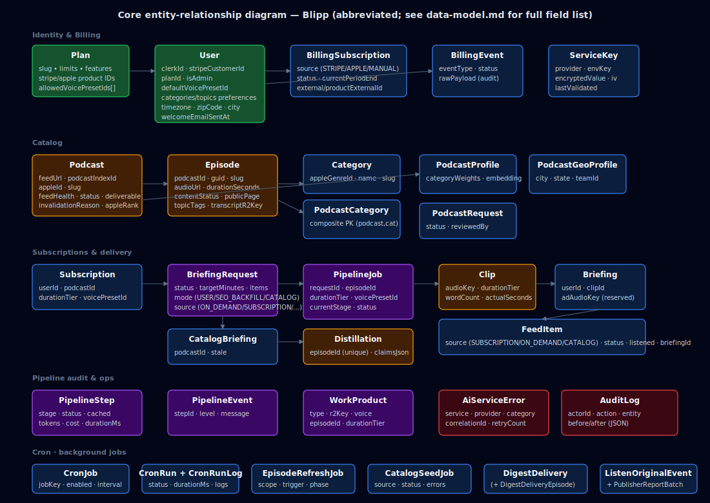

# Blipp Data Model Reference

Generated from `prisma/schema.prisma` — **60 models · 20 enums** as of this revision. The canonical source of truth is `prisma/schema.prisma`; this page is a navigable summary grouped by domain.

## Entity Overview



The diagram above shows the most load-bearing relationships. Complete domain inventories follow.

## Generators

| Generator | Output | Runtime | Purpose |
|-----------|--------|---------|---------|
| `client` | `src/generated/prisma` | `cloudflare` | Worker runtime |
| `scripts` | `src/generated/prisma-node` | `nodejs` | CLI scripts (seed, `db:check`, clean, migrate) |

After running `npx prisma generate`, a barrel export is committed at `src/generated/prisma/index.ts` (gitignored). Datasource is PostgreSQL (Neon) via the Cloudflare runtime adapter over Hyperdrive.

## Models by Domain

### Identity, Plans, Billing

| Model | Purpose | Notable fields |
|-------|---------|----------------|
| **Plan** | Subscription tier with limits, feature flags, billing product IDs (Stripe + Apple), and allowed voice presets. | `slug` (unique), `briefingsPerWeek`, `maxDurationMinutes`, `maxPodcastSubscriptions`, `pastEpisodesLimit`, `concurrentPipelineJobs`, `transcriptAccess`, `dailyDigest`, `adFree`, `priorityProcessing`, `earlyAccess`, `offlineAccess`, `publicSharing`, `priceCentsMonthly`, `stripePriceId{Monthly,Annual}`, `appleProductId{Monthly,Annual}`, `allowedVoicePresetIds[]`, `highlighted`, `isDefault`. |
| **User** | Clerk-authenticated user profile. | `clerkId` (unique), `email` (unique), `stripeCustomerId` (unique), `planId` (FK), `isAdmin`, `status` (`active/suspended/banned`), `onboardingComplete`, `defaultDurationTier`, `defaultVoicePresetId`, `acceptAnyVoice`, `preferredCategories[]`, `excludedCategories[]`, `preferredTopics[]`, `excludedTopics[]`, `zipCode/city/state/country/timezone`, `welcomeEmailSentAt`, `subscriptionEndsAt`, `digestEnabled`, `digestInclude{Subscriptions,Favorites,Recommended}`. |
| **BillingSubscription** | Unified entitlement row per external subscription (Stripe, Apple, or manual admin grant). | `source` (enum `BillingSource`), `externalId`, `productExternalId`, `planId`, `status` (enum `BillingStatus`), `currentPeriodEnd`, `willRenew`, `rawPayload` JSON. Unique: `(source, externalId)`. |
| **BillingEvent** | Append-only audit trail of billing events (webhooks + admin + REST). | `userId?`, `source`, `eventType`, `environment`, `externalId?`, `productExternalId?`, `status` (`APPLIED/SKIPPED/FAILED`), `skipReason?`, `rawPayload`. Indexes: `(userId, createdAt)`, `(source, createdAt)`. |
| **ServiceKey** | Encrypted third-party API key (AES-256-GCM at rest). | `provider`, `envKey`, `encryptedValue`, `iv`, `maskedPreview`, `isPrimary`, `lastValidated`, `lastValidatedOk`, `lastRotated`, `rotateAfterDays`. Indexed on `(envKey, isPrimary)`. |
| **ApiKey** | Programmatic-access Bearer tokens (hashed, scoped). | `keyHash` (SHA-256, unique), `keyPrefix`, `scopes[]`, `expiresAt?`, `revokedAt?`, `lastUsedAt?`, owner `userId`. |
| **AuditLog** | Admin action audit trail. | `actorId`, `actorEmail?`, `action`, `entityType`, `entityId`, `before?`/`after?` JSON snapshots, `metadata?` (ip, userAgent). Indexes by actor, entity, and createdAt. |

### Catalog (Podcasts, Episodes, Categories)

| Model | Purpose | Notable fields |
|-------|---------|----------------|
| **Podcast** | Ingested podcast feed. | `feedUrl` (unique), `podcastIndexId?` (unique), `appleId?` (unique), `slug` (unique), `feedHealth`, `feedError`, `episodeCount`, `status` (`active/paused/archived/pending_deletion/evicted/music`), `deliverable`, `invalidationReason?`, `invalidatedAt?`, `appleRank?` (Top 200), `piRank?`, `source` (`trending/user_request/manual`), `appleMetadata` JSON, `lastDetailViewedAt?`, `geoProcessedAt?`. |
| **Episode** | RSS episode. | `podcastId`, `guid`, `slug` (per-podcast unique), `audioUrl`, `publishedAt`, `durationSeconds?`, `transcriptUrl?`, `contentStatus` (enum `ContentStatus`), `transcriptR2Key?`, `audioR2Key?`, `topicTags[]`, `publicPage`. Unique: `(podcastId, guid)` and `(podcastId, slug)`. Index: `(podcastId, publishedAt)`. |
| **PodcastRequest** | User submission for adding a podcast to the catalog. | `userId`, `feedUrl`, `status` (`PENDING/APPROVED/REJECTED/DUPLICATE`), `podcastId?`, admin fields (`adminNote`, `reviewedBy`, `reviewedAt`). Unique: `(userId, feedUrl)`. |
| **Category** | Apple genre taxonomy. | `appleGenreId` (unique), `name`, `slug` (unique). |
| **PodcastCategory** | Many-to-many join between `Podcast` and `Category`. | Composite PK `(podcastId, categoryId)`. Cascade both sides. |

### Recommendations & Engagement

| Model | Purpose | Notable fields |
|-------|---------|----------------|
| **PodcastProfile** | Per-podcast signals for recommendation scoring. | `podcastId` (unique), `categoryWeights` JSON, `topicTags[]`, `popularity`, `freshness`, `subscriberCount`, `embedding` JSON (768-dim). |
| **UserRecommendationProfile** | Per-user aggregated preferences. | `userId` (unique), `categoryWeights` JSON, `topicTags[]`, `listenCount`, `embedding` JSON. |
| **RecommendationCache** | Top-20 precomputed recommendations. | `userId` (unique), `podcasts` JSON `[{ podcastId, score, reasons[] }]`. |
| **RecommendationDismissal** | Dismissed-from-recommendations entries. | `(userId, podcastId)` unique. |
| **PodcastFavorite** | Bookmark / interest signal. | `(userId, podcastId)` unique. |
| **PodcastVote** | Thumbs up / down on a podcast. | `vote` (`1 / -1`); `(userId, podcastId)` unique. |
| **EpisodeVote** | Thumbs up / down on an episode. | `vote` (`1 / -1`); `(userId, episodeId)` unique. |
| **PushSubscription** | Web Push subscription (VAPID). | `endpoint` (unique), `p256dh`, `auth`, `userId`. |

### Content Pipeline (Distillation, Clips, Briefings, Feed)

| Model | Purpose | Notable fields |
|-------|---------|----------------|
| **Distillation** | Transcript + extracted claims for an episode (cache). | `episodeId` (unique — 1:1), `status` (enum `DistillationStatus`), `transcript?`, `claimsJson?`. |
| **Clip** | Rendered audio clip for a given `(episode, durationTier, voicePreset)`. | `status` (enum `ClipStatus`), `narrativeText?`, `wordCount?`, `audioKey?`, `audioContentType?`, `audioUrl?`, `actualSeconds?`, `voiceDegraded?`. Unique: `(episodeId, durationTier, voicePresetId)`. |
| **CatalogBriefing** | Pre-generated catalog briefing for instant signup delivery (no user). | `episodeId`, `podcastId`, `durationTier`, `clipId`, `requestId` (FK), `stale`. Unique: `(episodeId, durationTier)`. Index: `(podcastId, stale, createdAt)`. |
| **Subscription** | User ↔ Podcast subscription with per-sub tier + voice. | `userId`, `podcastId`, `durationTier`, `voicePresetId?`. Unique: `(userId, podcastId)`. |
| **Briefing** | Per-user wrapper over a shared `Clip`. Carries personalized ad audio. | `userId`, `clipId`, `adAudioUrl?`, `adAudioKey?`. Unique: `(userId, clipId)`. |
| **FeedItem** | Per-user feed entry. | `userId`, `episodeId`, `podcastId`, `briefingId?`, `durationTier`, `source` (enum `FeedItemSource`: `SUBSCRIPTION/ON_DEMAND/SHARED/CATALOG`), `status` (enum `FeedItemStatus`: `PENDING/PROCESSING/READY/FAILED/CANCELLED`), `listened`, `listenedAt?`, `playbackPositionSeconds?`, `requestId?`. Unique: `(userId, episodeId, durationTier)`. Indexes: `(userId, status, createdAt)`, `(userId, listened, createdAt)`. |

### Pipeline Orchestration & Audit

| Model | Purpose | Notable fields |
|-------|---------|----------------|
| **BriefingRequest** | Pipeline entry point. | `userId`, `status` (`PENDING/PROCESSING/CANCELLED/COMPLETED/COMPLETED_DEGRADED/FAILED`), `targetMinutes`, `items` JSON (`BriefingRequestItem[]`), `mode` (`USER/SEO_BACKFILL/CATALOG`), `source` (`ON_DEMAND/SUBSCRIPTION/SHARE/STARTER_PACK/CATALOG_PREGEN_*/SEO_BACKFILL/ADMIN_TEST`), `isTest`, `cancelledAt?`. Index: `source`. |
| **PipelineJob** | One episode+tier processed for a request. | `requestId`, `episodeId`, `durationTier`, `voicePresetId?`, `status` (enum `PipelineJobStatus`), `currentStage` (enum `PipelineStage`), `distillationId?`, `clipId?`, `completedAt?`, `dismissedAt?`. Index: `(requestId, status)`. |
| **PipelineStep** | Audit trail for a stage attempt on a job. | `jobId`, `stage`, `status` (enum `PipelineStepStatus`), `cached`, `input?`, `output?`, `errorMessage?`, `startedAt?`, `completedAt?`, `durationMs?`, `cost?`, `model?`, `inputTokens?`, `outputTokens?`, `cacheCreationTokens?`, `cacheReadTokens?`, `audioSeconds?`, `charCount?`, `retryCount`, `workProductId?`. |
| **PipelineEvent** | Structured log entry for a step. | `stepId`, `level` (`DEBUG/INFO/WARN/ERROR`), `message`, `data?`. Index: `(stepId, createdAt)`. |
| **WorkProduct** | R2 artifact index — every pipeline output. | `type` (enum `WorkProductType`: `TRANSCRIPT/CLAIMS/NARRATIVE/AUDIO_CLIP/BRIEFING_AUDIO/SOURCE_AUDIO/DIGEST_NARRATIVE/DIGEST_CLIP/DIGEST_AUDIO`), `episodeId?`, `userId?`, `durationTier?`, `voice?`, `r2Key` (unique), `sizeBytes?`, `metadata?`. |

### AI Service & Experimentation

| Model | Purpose | Notable fields |
|-------|---------|----------------|
| **AiModel** | Model catalog (Whisper, Claude Sonnet, Deepgram Nova, …). | `modelId` (unique), `label`, `developer`, `stages[]` (enum `AiStage`: `stt/distillation/narrative/tts/geoClassification`), `notes?`, `isActive`. |
| **AiModelProvider** | Provider-specific config + pricing for a model. | `aiModelId`, `provider`, `providerModelId?`, `providerLabel`, `pricePerMinute?`, `priceInputPerMToken?`, `priceOutputPerMToken?`, `pricePerKChars?`, `isDefault`, `isAvailable`, `limits?` JSON, `priceUpdatedAt?`. Unique: `(aiModelId, provider)`. |
| **AiServiceError** | Classified provider error record. | `service`, `provider`, `model`, `operation`, `correlationId`, `jobId?`, `stepId?`, `episodeId?`, `category`, `severity`, `httpStatus?`, `errorMessage`, `rawResponse?`, `requestDurationMs`, `retryCount`, `maxRetries`, `willRetry`, `resolved`, `rateLimitRemaining?`, `rateLimitResetAt?`. |
| **SttExperiment** | STT benchmark run. | `name`, `status` (enum `SttExperimentStatus`), `config` JSON (`{models, speeds, episodeIds}`), `totalTasks`, `doneTasks`, `completedAt?`. |
| **SttBenchmarkResult** | Individual STT result. | `experimentId`, `episodeId`, `model`, `provider?`, `speed`, `status`, `costDollars?`, `latencyMs?`, `wer?`, `wordCount?`, `refWordCount?`, `r2AudioKey?`, `r2TranscriptKey?`, `r2RefTranscriptKey?`, `pollingId?`. Unique: `(experimentId, episodeId, model, provider, speed)`. |
| **ClaimsExperiment** | Claims-extraction benchmark run. | `name`, `status` (enum `ClaimsExperimentStatus`), `baselineModelId?`, `baselineProvider?`, `judgeModelId?`, `judgeProvider?`, `config`, `totalTasks`, `doneTasks`, `totalJudgeTasks`, `doneJudgeTasks`. |
| **ClaimsBenchmarkResult** | Individual claims-extraction result + judge score. | `experimentId`, `episodeId`, `model`, `provider`, `isBaseline`, `status`, `claimCount?`, `inputTokens?`, `outputTokens?`, `costDollars?`, `latencyMs?`, `coverageScore?`, `weightedCoverageScore?`, `hallucinations?`, `judgeStatus?`, `r2ClaimsKey?`, `r2JudgeKey?`. Unique: `(experimentId, episodeId, model, provider)`. |

### Configuration & Content Authoring

| Model | Purpose | Notable fields |
|-------|---------|----------------|
| **PlatformConfig** | Runtime key/value store (60-second TTL cache). | `key` (unique), `value` JSON, `description?`, `updatedBy?`. |
| **PromptVersion** | Versioned LLM prompt templates. | `stage`, `version`, `label`, `values` JSON `Record<promptKey,value>`, `notes?`, `createdBy?`. Unique: `(stage, version)`. |
| **VoicePreset** | TTS voice configuration across providers. | `name` (unique), `description?`, `isSystem`, `isActive`, `config` JSON (`{openai:{voice,instructions,speed}, groq:{voice}, cloudflare:{}}`), `voiceCharacteristics?`. |

### Scheduled Jobs & Admin Operations

| Model | Purpose | Notable fields |
|-------|---------|----------------|
| **CronJob** | Declarative job registry with toggle + schedule. | `jobKey` (unique), `label`, `description?`, `enabled`, `intervalMinutes`, `defaultIntervalMinutes`, `runAtHour?` (0–23 UTC), `lastRunAt?`. |
| **CronRun** | Execution record. | `jobKey`, `startedAt`, `completedAt?`, `durationMs?`, `status` (enum `CronRunStatus`), `result?`, `errorMessage?`. Index: `(jobKey, startedAt desc)`. |
| **CronRunLog** | Per-run log entries. | `runId`, `level` (enum `CronRunLogLevel`), `message`, `data?`, `timestamp`. |
| **CatalogSeedJob** | Catalog discovery run (Apple top-200 / Podcast Index). | `source`, `trigger`, `status`, `podcastsDiscovered`, `error?`, `archivedAt?`. |
| **CatalogJobError** | Error entry for catalog seed phases. | `jobId`, `phase`, `message`, `podcastId?`, `episodeId?`. |
| **EpisodeRefreshJob** | Episode refresh run (feed-scan + content prefetch). | `scope` (`subscribed/all/seed`), `trigger`, `catalogSeedJobId?`, `status` (`pending/refreshing/paused/cancelled/complete/failed`), `podcastsTotal/Completed/WithNewEpisodes`, `episodesDiscovered`, `prefetchTotal/Completed`, `archivedAt?`. |
| **EpisodeRefreshError** | Error entry for episode refresh phases. | `jobId`, `phase` (`feed_scan/prefetch`), `message`, `podcastId?`, `episodeId?`. |

### Feedback, Support, Analytics

| Model | Purpose | Notable fields |
|-------|---------|----------------|
| **Feedback** | Generic user feedback. | `userId`, `message`. |
| **BlippFeedback** | Per-blipp feedback with structured reasons. | `userId`, `episodeId`, `briefingId?`, `reasons[]` (`blipp_failed/missed_key_points/inaccurate/too_short/too_long/poor_audio/not_interesting`), `message?`, `isTechnicalFailure`. Indexes: `(userId)`, `(episodeId)`, `(createdAt)`, `(isTechnicalFailure, createdAt)`. |
| **SupportMessage** | Public contact-form submission (no auth required). | `name`, `email`, `subject`, `message`, `userAgent?`, `status` (default `open`). |
| **ListenOriginalEvent** | Conversion tracking for "listen to original" clicks → starts → completes. | `eventType` (enum), `userId?`, `sessionId`, `deviceType?` (enum), `platform?` (enum), `blippId?`, `blippDurationMs?`, `episodeId?`, `podcastId?`, `publisherId?`, `referralSource?` (enum), `timeToClickSec?`, `blippCompletionPct?`, `didReturnToBlipp?`, `utm{Source,Medium,Campaign}?`, `reportBatchId?`. Indexes by publisher, user, blipp funnel, episode. |
| **PublisherReportBatch** | Aggregated publisher report (nightly). | `publisherId`, `periodStart`, `periodEnd`, `totalClicks`, `totalStarts`, `totalCompletes`, `uniqueUsers`. |

### Sports + Geo

| Model | Purpose | Notable fields |
|-------|---------|----------------|
| **SportsLeague** | Sports league (NFL, NBA, Premier League). | `name` (unique), `sport`, `country?`. |
| **SportsDivision** | Division/conference with self-referential parent (e.g. AFC → AFC East). | `leagueId`, `parentId?`, `(leagueId, name)` unique. |
| **SportsTeam** | Team. | `leagueId`, `divisionId?`, `name`, `city?`, `nickname?`, `abbreviation`, `keywords[]`. Unique: `(leagueId, abbreviation)`. |
| **SportsTeamMarket** | Geographic markets for a team. | `teamId`, `city`, `state`. Unique: `(teamId, city, state)`. Index: `(city, state)`. |
| **UserSportsTeam** | User's selected teams. | `(userId, teamId)` unique. |
| **PodcastGeoProfile** | Podcast's geographic relevance + sports tag. | `podcastId`, `city`, `state`, `country`, `scope` (`city/regional/state`), `teamId?`, `confidence` (0–1), `source` (`keyword/llm`). Unique: `(podcastId, city, state)`. |

### Daily Digest

| Model | Purpose | Notable fields |
|-------|---------|----------------|
| **DigestDelivery** | A day's digest for a user. | `userId`, `date` (YYYY-MM-DD), `status` (`PENDING/PROCESSING/READY/FAILED`), `totalEpisodes`, `completedEpisodes`, `audioKey?`, `actualSeconds?`, `episodeCount`, `sources` JSON (`DigestSource[]`), `listened`, `errorMessage?`. Unique: `(userId, date)`. |
| **DigestDeliveryEpisode** | Episode entry within a digest. | `deliveryId`, `episodeId`, `sourceType` (`subscribed/favorited/recommended`), `status`, `entryStage?`, `actualSeconds?`. Unique: `(deliveryId, episodeId)`. |

## Enums

| Enum | Values |
|------|--------|
| `ContentStatus` | `PENDING`, `TRANSCRIPT_READY`, `AUDIO_READY`, `NOT_DELIVERABLE` |
| `DistillationStatus` | `PENDING`, `FETCHING_TRANSCRIPT`, `TRANSCRIPT_READY`, `EXTRACTING_CLAIMS`, `COMPLETED`, `FAILED` |
| `ClipStatus` | `PENDING`, `GENERATING_NARRATIVE`, `GENERATING_AUDIO`, `COMPLETED`, `FAILED` |
| `FeedItemSource` | `SUBSCRIPTION`, `ON_DEMAND`, `SHARED`, `CATALOG` |
| `FeedItemStatus` | `PENDING`, `PROCESSING`, `READY`, `FAILED`, `CANCELLED` |
| `PipelineStage` | `TRANSCRIPTION`, `DISTILLATION`, `CLIP_GENERATION` (legacy, kept for existing data), `NARRATIVE_GENERATION`, `AUDIO_GENERATION`, `BRIEFING_ASSEMBLY` |
| `PipelineJobStatus` | `PENDING`, `IN_PROGRESS`, `COMPLETED`, `COMPLETED_DEGRADED`, `FAILED`, `CANCELLED` |
| `PipelineStepStatus` | `PENDING`, `IN_PROGRESS`, `COMPLETED`, `SKIPPED`, `FAILED` |
| `PipelineEventLevel` | `DEBUG`, `INFO`, `WARN`, `ERROR` |
| `BriefingRequestMode` | `USER`, `SEO_BACKFILL`, `CATALOG` |
| `BriefingRequestSource` | `ON_DEMAND`, `SUBSCRIPTION`, `SHARE`, `STARTER_PACK`, `CATALOG_PREGEN_FEED_REFRESH`, `CATALOG_PREGEN_CRON`, `CATALOG_PREGEN_ADMIN`, `SEO_BACKFILL`, `ADMIN_TEST` |
| `BriefingRequestStatus` | `PENDING`, `PROCESSING`, `CANCELLED`, `COMPLETED`, `COMPLETED_DEGRADED`, `FAILED` |
| `WorkProductType` | `TRANSCRIPT`, `CLAIMS`, `NARRATIVE`, `AUDIO_CLIP`, `BRIEFING_AUDIO`, `SOURCE_AUDIO`, `DIGEST_NARRATIVE`, `DIGEST_CLIP`, `DIGEST_AUDIO` |
| `SttExperimentStatus` | `PENDING`, `RUNNING`, `COMPLETED`, `FAILED`, `CANCELLED` |
| `ClaimsExperimentStatus` | `PENDING`, `RUNNING`, `JUDGING`, `COMPLETED`, `FAILED`, `CANCELLED` |
| `AiStage` | `stt`, `distillation`, `narrative`, `tts`, `geoClassification` |
| `CronRunStatus` | `IN_PROGRESS`, `SUCCESS`, `FAILED` |
| `CronRunLogLevel` | `DEBUG`, `INFO`, `WARN`, `ERROR` |
| `ListenOriginalEventType` | `listen_original_click`, `listen_original_start`, `listen_original_complete` |
| `DeviceType` | `mobile`, `desktop`, `tablet` |
| `AppPlatform` | `ios`, `android`, `web` |
| `ReferralSource` | `feed`, `search`, `share`, `notification` |
| `BillingSource` | `STRIPE`, `APPLE`, `MANUAL` |
| `BillingStatus` | `ACTIVE`, `CANCELLED_PENDING_EXPIRY`, `GRACE_PERIOD`, `EXPIRED`, `REFUNDED`, `PAUSED` |

## Cascade Behaviour

Foreign keys use `onDelete: Cascade` except where noted. Deleting a parent removes its descendants:

| Parent | Cascaded children |
|--------|-------------------|
| `User` | `Subscription`, `Briefing`, `FeedItem`, `BriefingRequest`, `BillingSubscription`, `BillingEvent` (`onDelete: SetNull`, preserves event history), `ApiKey`, `PodcastFavorite`, `PodcastVote`, `EpisodeVote`, `PushSubscription`, `PodcastRequest`, `UserRecommendationProfile`, `RecommendationCache`, `RecommendationDismissal`, `Feedback`, `BlippFeedback`, `ListenOriginalEvent`, `UserSportsTeam`, `DigestDelivery`. |
| `Plan` | *(no cascade — `User.planId` references `Plan` without cascade; deletion is prevented by FK.)* |
| `Podcast` | `Episode`, `Subscription`, `FeedItem`, `PodcastCategory`, `PodcastProfile`, `PodcastFavorite`, `PodcastVote`, `PodcastRequest`, `PodcastGeoProfile`, `RecommendationDismissal`, `CatalogBriefing`. |
| `Episode` | `Distillation`, `Clip`, `FeedItem`, `PipelineJob`, `WorkProduct`, `EpisodeVote`, `SttBenchmarkResult`, `ClaimsBenchmarkResult`, `BlippFeedback`, `ListenOriginalEvent`, `DigestDeliveryEpisode`, `CatalogBriefing`. |
| `Distillation` | `Clip`. |
| `Clip` | `Briefing`, `CatalogBriefing`. |
| `BriefingRequest` | `PipelineJob`, `FeedItem`, `CatalogBriefing`. |
| `PipelineJob` | `PipelineStep`. |
| `PipelineStep` | `PipelineEvent`. |
| `AiModel` | `AiModelProvider`. |
| `SttExperiment` / `ClaimsExperiment` | respective benchmark results. |
| `CronRun` | `CronRunLog`. |
| `CatalogSeedJob` | `CatalogJobError`. |
| `EpisodeRefreshJob` | `EpisodeRefreshError`. |
| `DigestDelivery` | `DigestDeliveryEpisode`. |
| `SportsLeague` | `SportsDivision`, `SportsTeam`. |
| `SportsTeam` | `SportsTeamMarket`, `UserSportsTeam`, `PodcastGeoProfile`. |
| `Category` | `PodcastCategory`. |

## Indexing Highlights

Representative indexes for query hot-paths (full list in `prisma/schema.prisma`):

- `FeedItem(userId, status, createdAt)` — primary feed list.
- `FeedItem(userId, listened, createdAt)` — listened/unlistened filters.
- `Episode(podcastId, publishedAt)` — "latest episode" lookups in the orchestrator.
- `PipelineJob(requestId, status)` — request detail pages.
- `PipelineEvent(stepId, createdAt)` — step event timeline.
- `AiServiceError(service, provider, createdAt)`, `(correlationId)`, `(category, createdAt)`, `(episodeId)`, `(resolved, createdAt)` — admin AI error explorer.
- `ListenOriginalEvent(publisherId, timestamp)`, `(blippId, eventType)`, `(episodeId, timestamp)`, `(reportBatchId)` — publisher reporting.
- `BillingSubscription(userId, status)`, `BillingEvent(userId, source, createdAt)` — entitlement recompute.
- `CronRun(jobKey, startedAt DESC)` — recent job runs.

## Migrations

Schema changes flow through Prisma migrations:

```bash
# Generate a new migration from schema.prisma changes (after editing)
npm run db:migrate:new <snake_case_name>

# Apply pending migrations
npm run db:migrate:deploy:staging
npm run db:migrate:deploy:production

# Status
npm run db:migrate:status:staging
npm run db:migrate:status:production
```

CI applies `prisma migrate deploy` automatically before `wrangler deploy` (staging on push to `main`, production via the `/deploy-production` workflow). `prisma migrate deploy` only rolls forward — destructive renames/drops must be expressed as explicit SQL in the migration file. See [guides/prisma-migrations.md](./guides/prisma-migrations.md) for the full workflow and break-glass `npm run db:force-sync:*` escape hatches.
