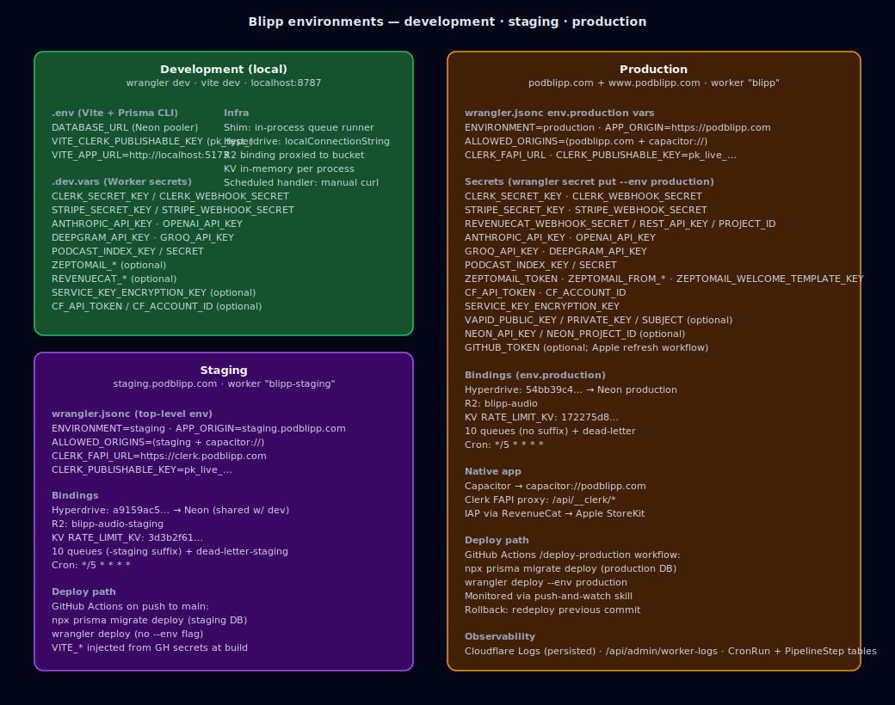

# Blipp Environments & Configuration

Three environments share one codebase:

- **Development** — `wrangler dev` + `vite dev` on `localhost:8787`, using `.dev.vars` (Worker secrets) and `.env` (Vite + Prisma CLI).
- **Staging** — `staging.podblipp.com`, Worker `blipp-staging`. Deployed automatically on push to `main`.
- **Production** — `podblipp.com` + `www.podblipp.com` (native shell uses `capacitor://podblipp.com`). Worker `blipp`. Deployed via the `/deploy-production` GitHub Actions workflow.

## Key binding differences

| Binding | Development | Staging | Production |
|---------|-------------|---------|-----------|
| `ENVIRONMENT` | `"development"` | `"staging"` | `"production"` |
| `APP_ORIGIN` | `http://localhost:5173` | `https://staging.podblipp.com` | `https://podblipp.com` |
| `ALLOWED_ORIGINS` | `localhost:*` + `capacitor://*` | staging + `capacitor://*` | prod + `capacitor://*` |
| `CLERK_FAPI_URL` | `https://clerk.podblipp.com` | `https://clerk.podblipp.com` | `https://clerk.podblipp.com` |
| Hyperdrive | n/a (uses `localConnectionString`) | `a9159ac5…` → Neon staging | `54bb39c4…` → Neon production |
| R2 bucket | Cloudflare proxied for local | `blipp-audio-staging` | `blipp-audio` |
| KV `RATE_LIMIT_KV` | in-memory fallback | `3d3b2f61…` | `172275d8…` |
| Queues | in-process shim (`shimQueuesForLocalDev`) | 10 queues + `dead-letter-staging` + `feed-refresh-retry-staging` | 10 queues + `dead-letter` + `feed-refresh-retry` |
| Cron trigger | manual invocation only | `*/5 * * * *` | `*/5 * * * *` |

## Queues (10 consumer pairs + DLQ variants)

Queues follow the naming `<role>[-staging|-production]` with the worker dispatcher stripping the suffix before routing:

- `orchestrator` · `transcription` · `distillation` · `narrative-generation` · `clip-generation` (maps from `AUDIO_GENERATION_QUEUE`) · `briefing-assembly`
- `feed-refresh` (+ `feed-refresh-retry`) · `catalog-refresh` · `content-prefetch`
- `welcome-email`
- `dead-letter` (terminal sink for all the above)

## Secrets & keys per environment

See [guides/development.md](./guides/development.md) for the full list and the `.dev.vars` template. Highlights added since the previous revision:

- **Mobile IAP** — `REVENUECAT_WEBHOOK_SECRET`, `REVENUECAT_REST_API_KEY`, `REVENUECAT_PROJECT_ID`.
- **Welcome email** — `ZEPTOMAIL_TOKEN`, `ZEPTOMAIL_FROM_ADDRESS`, `ZEPTOMAIL_FROM_NAME`, `ZEPTOMAIL_WELCOME_TEMPLATE_KEY`.
- **Worker observability** — `CF_API_TOKEN`, `CF_ACCOUNT_ID`, `WORKER_SCRIPT_NAME`.
- **Encrypted service keys** — `SERVICE_KEY_ENCRYPTION_KEY` (AES-256 master key, 64-hex).
- **Web Push** — `VAPID_PUBLIC_KEY`, `VAPID_PRIVATE_KEY`, `VAPID_SUBJECT` (optional).
- **Backup verification** — `NEON_API_KEY`, `NEON_PROJECT_ID` (optional).

## Deployment

- **Staging**: `git push origin main` → GitHub Actions runs `prisma migrate deploy` against the staging DB, then `wrangler deploy` without `--env`. `push-and-watch` skill streams progress.
- **Production**: invoke the `/deploy-production` workflow (CLI skill `deploy-production`) → runs `prisma migrate deploy` against the production DB, then `wrangler deploy --env production`.
- **Migrations**: only forward-rolling. Destructive renames/drops must be expressed as explicit SQL in the generated `migration.sql`. Break-glass escape: `npm run db:force-sync:staging` / `db:force-sync:production` (calls `prisma db push --accept-data-loss`) — desyncs the migration history and requires `prisma migrate resolve` follow-up. See [guides/prisma-migrations.md](./guides/prisma-migrations.md).
